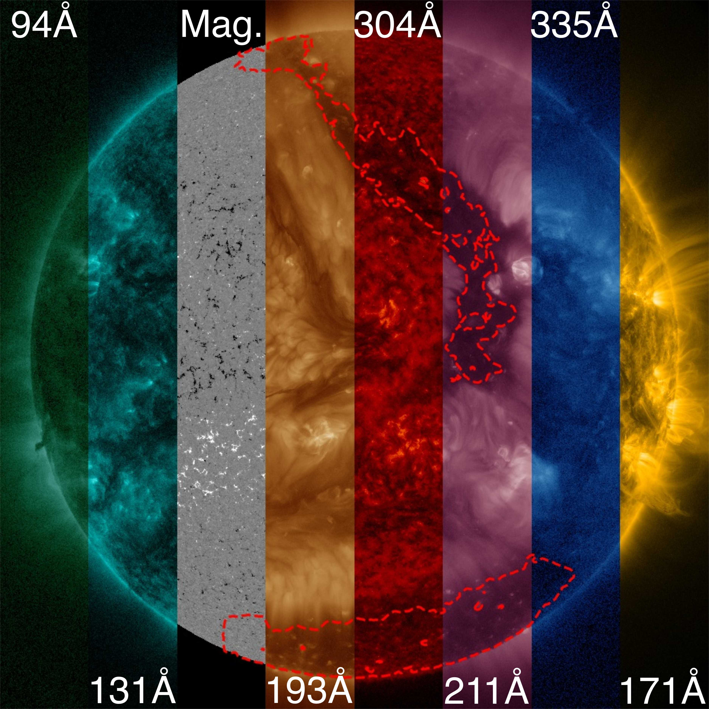

# Multi-channel coronal hole detection with convolutional neural networks | **CHRONNOS**

---

The precise detection of the coronal hole boundary is of primary interest for a better understanding of the physics of coronal holes, their role in the solar cycle evolution and space weather forecasting.
We develop a reliable, fully automatic method for the detection of coronal holes, that provides consistent full-disk segmentation maps over the full solar cycle and can perform in real-time.
We use a convolutional neural network to identify the boundaries of coronal holes from the seven EUV channels of the Atmospheric Imaging Assembly (AIA) as well as from line-of-sight magnetograms from the Helioseismic and Magnetic Imager (HMI) onboard the Solar Dynamics Observatory (SDO). For our primary model (Coronal Hole RecOgnition Neural Network Over multi-Spectral-data; CHRONNOS) we use a progressively growing network approach that allows for efficient training, provides detailed segmentation maps and takes relations across the full solar-disk into account. For our second approach, we aim for increased interpretability and train a neural network to identify coronal holes from each channel separately (Single Channel Analyzing Network; SCAN).
We provide a thorough evaluation for performance, reliability and consistency by comparing the model results to an independent manually curated test set.
Our model shows good agreement to the manual labels with an intersection-over-union (IoU) of 0.68. From the total 262 coronal holes with an area >1.5 1010 km2, 98.1% were correctly detected by our model. The evaluation over almost the full solar cycle no. 24 shows that our model provides reliable coronal detections, independent of the solar activity.
From the direct comparison over short time scales of days to weeks, we find that our model exceeds human performance in terms of consistency and reliability.
The evaluation of SCAN shows that the neural network provides the best performance with the combined channel information, but that coronal hole segmentation maps can be also obtained solely from line-of-sight magnetograms.
The proposed neural network provides a reliable data set for the study of solar cycle dependencies and coronal hole parameters. Due to the fast and robust coronal hole segmentation, the algorithm is also highly suitable for real-time space weather applications.

---

