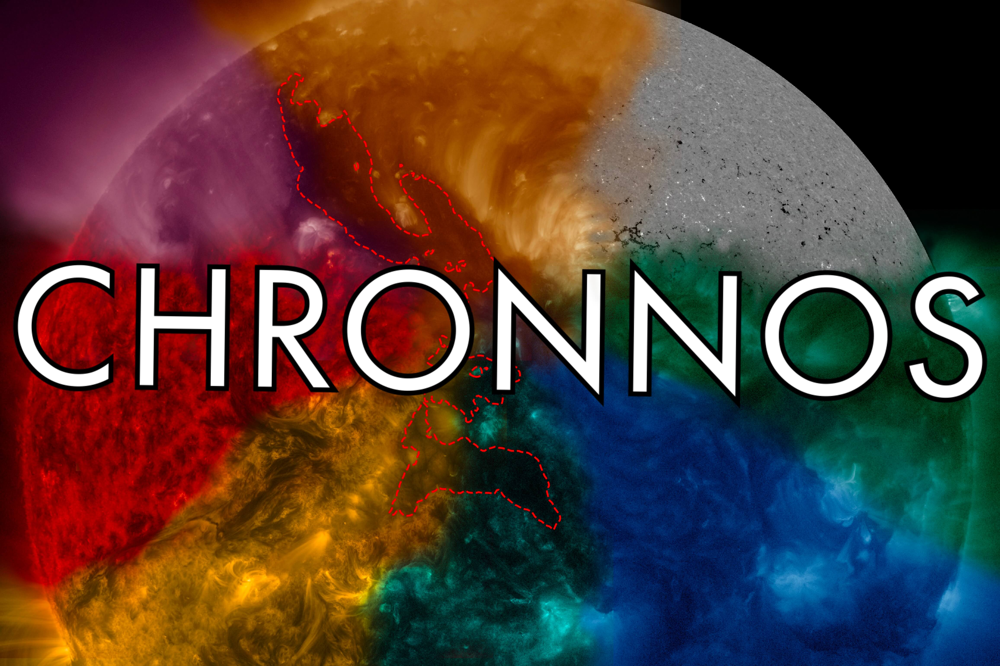
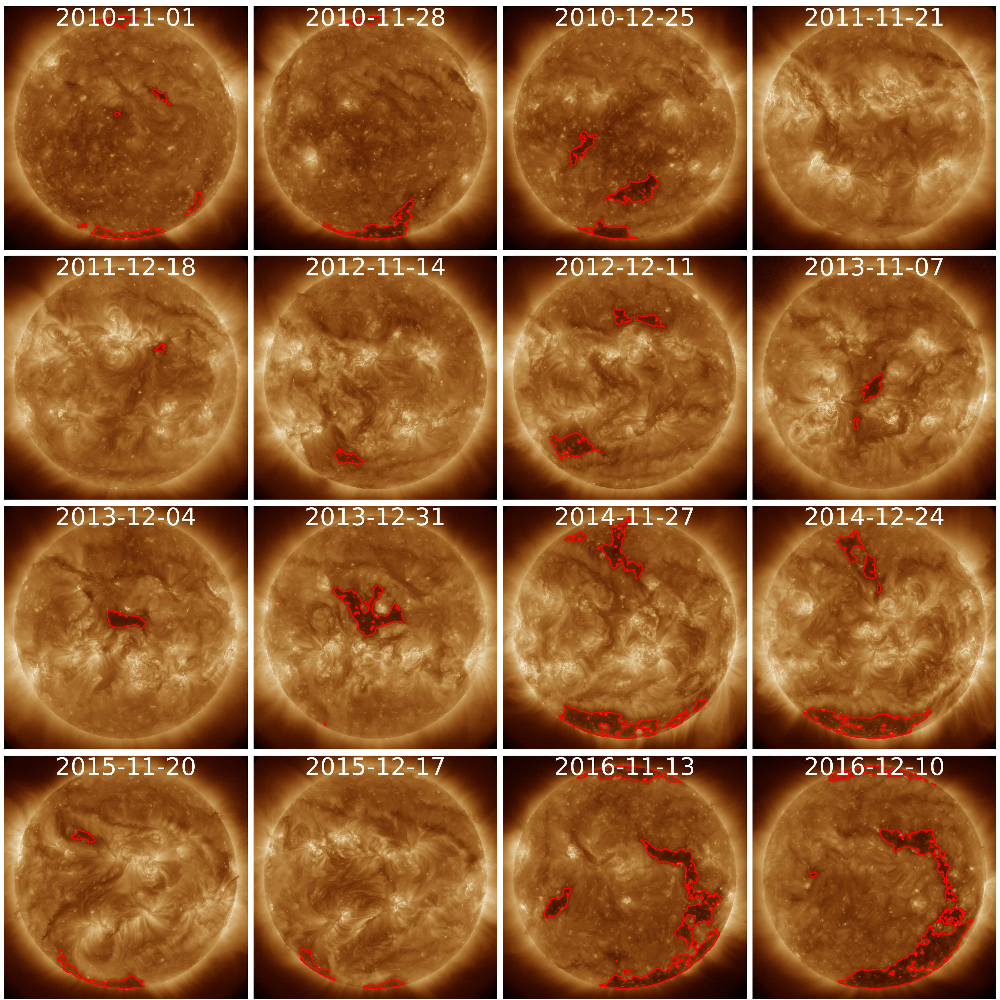

---
# Multi-channel coronal hole detection with convolutional neural networks

[Usage](#usage) --- [Data](#data) --- [Paper](#paper) --- [Citation](#citation) --- [Contact](#contact)


[For automatic coronal hole detection of arbitrary dates and series click here](https://colab.research.google.com/github/RobertJaro/MultiChannelCHDetection/blob/master/examples/CHRONNOS.ipynb)
[](https://colab.research.google.com/github/RobertJaro/MultiChannelCHDetection/blob/master/examples/CHRONNOS.ipynb)


## Abstract

_Context._ A precise detection of the coronal hole boundary is of primary interest for a better understanding of the physics of coronal
holes, their role in the solar cycle evolution, and space weather forecasting.

_Aims._ We develop a reliable, fully automatic method for the detection of coronal holes that provides consistent full-disk segmentation
maps over the full solar cycle and can perform in real-time.

_Methods._ We use a convolutional neural network to identify the boundaries of coronal holes from the seven extreme ultraviolet (EUV)
channels of the Atmospheric Imaging Assembly (AIA) and from the line-of-sight magnetograms provided by the Helioseismic and
Magnetic Imager (HMI) on board the Solar Dynamics Observatory (SDO). For our primary model (Coronal Hole RecOgnition Neural
Network Over multi-Spectral-data; CHRONNOS) we use a progressively growing network approach that allows for efficient training,
provides detailed segmentation maps, and takes into account relations across the full solar disk.

_Results._ We provide a thorough evaluation for performance, reliability, and consistency by comparing the model results to an independent
manually curated test set. Our model shows good agreement to the manual labels with an intersection-over-union (IoU) of
0.63. From the total of 261 coronal holes with an area > 1.5e10 km2 identified during the time-period from November 2010 to December
2016, 98.1% were correctly detected by our model. The evaluation over almost the full solar cycle no. 24 shows that our model
provides reliable coronal hole detections independent of the level of solar activity. From a direct comparison over short timescales of
days to weeks, we find that our model exceeds human performance in terms of consistency and reliability. In addition, we train our
model to identify coronal holes from each channel separately and show that the neural network provides the best performance with
the combined channel information, but that coronal hole segmentation maps can also be obtained from line-of-sight magnetograms
alone.

_Conclusions._ The proposed neural network provides a reliable data set for the study of solar-cycle dependencies and coronal-hole
parameters. Given the fast and robust coronal hole segmentation, the algorithm is also highly suitable for real-time space weather
applications.

---

## Usage

The easiest way for getting started is the [Google Colab notebook](https://colab.research.google.com/github/RobertJaro/MultiChannelCHDetection/blob/master/examples/CHRONNOS.ipynb) 
for automatic coronal hole detections. This provides an online environment for downloading and analyzing data.

### chronnos package

For using CHRONNOS in your local environment use the pip installation:
``
pip install chronnos
``

or the conda installation:
``
conda install chronnos -c conda-forge
``

The `chronnos` package provides an automatic detector that can scan through FITS data sets. The pre-trained model is automatically
downloaded to your home directory.
```python
from chronnos.evaluate.detect import CHRONNOSDetector
chronnos_detector = CHRONNOSDetector(model_name='chronnos_v1_0.pt')
```

The detector can then be used to scan directories
```python
ch_maps = chronnos_detector.predict_dir('<<path to your base dir>>', dirs='<<list of directories (order must match the CHRONNOS input channels)>>',
                                        reproject=[True or False])
```

or the files can be manually specified (use the format `(channel, file)`)

```python
files = [['chronnos_data/171/1.fits'], ['chronnos_data/193/1.fits'], ['chronnos_data/211/1.fits'], ['chronnos_data/304/1.fits']]
ch_maps = chronnos_detector.predict(files, reproject=True)
```

For more details and instructions for data download check the Colab Notebook.

### Downloading data (python script)

CHRONNOS provides a data fetcher for downloading data from JSOC using DRMS.

- Download this project from GitHub to your local environment
- In the command line navigate to the project and run

```
python -m chronnos.data.download --path [download_path] --dates [list of dates] –-hmi_series [either hmi.M_720s or hmi.M_45s (default 720)] –-n_workers [number of parallel threads (default 8)]
```
- Example:
```
python -m chronnos.data.download /path/to/my/directory -–dates 2021-01-03T00:00 2021-01-04T00:00
```
The download tool will fetch the closest observations for the given times

### Detecting coronal holes (python script)

The prediction script scans through a directory, detects coronal holes and saves the results as FITS files.

- Download the prefered model: https://kanzelhohe.uni-graz.at/iti/chronnos_v1_0.pt or https://kanzelhohe.uni-graz.at/iti/chronnos_euv_v1_0.pt
- In the command line navigate to the project and run
```
python -m chronnos.predict --data_path [path to the data] --model_path [path to the model] --evaluation_path [result directory] --plot_samples [True to visualize the results (default True)]
```
The resulting FITS files contain the binary predictions and are reprojected to the coordinates of the original FITS files.

### Training CHRONNOS (python script)

CHRONNOS can be also trained for your own data set.

- Prepare your binary maps for training (FITS format) and download the SDO data
- In the command line navigate to the project and run
```
python -m chronnos.train_chronnos --base_path [result directory] --data_path [path to the FITS data] --converted_path [directory for the converted data] --convert [False if you want to skip converting the FITS data set (default True)] --channels [subset of wavelengths used for training (default all: 94, 131, 171, 193, 211, 304, 335, 6173)]
```

You can also skip the automatic conversion of FITS files and use your own data pre-processing. For this provide the 
maps and mask as `.npy` files and separate them into two directories (`map`, `mask`) in the `[converted_path]` directory.

(Note that this version expects all EUV channels and the LOS magnetogram for data pre-processing.)

## Data

The preparations for the CHRONNOS archive are ongoing. The archive will cover coronal hole detections at 6 hour cadence 
for the SDO era, coronal hole detections for SOHO, and synchronic Maps from STEREO and SDO (full-Sun coronal hole maps).

## Paper

Journal Version (A&A): https://doi.org/10.1051/0004-6361/202140640

Open access (arXiv): https://arxiv.org/abs/2104.14313

News article: https://www.skoltech.ru/en/2021/06/holes-in-the-solar-atmosphere-artificial-intelligence-spots-coronal-holes-to-automate-space-weather-prediction/

News article (german): https://news.uni-graz.at/de/detail/article/dunkle-seiten/

## Citation


```
@ARTICLE{Jarolim2021chronnos,
       author = {{Jarolim}, R. and {Veronig}, A.~M. and {Hofmeister}, S. and {Heinemann}, S.~G. and {Temmer}, M. and {Podladchikova}, T. and {Dissauer}, K.},
        title = "{Multi-channel coronal hole detection with convolutional neural networks}",
      journal = {Astronomy & Astrophysics},
     keywords = {Sun: activity, Sun: corona, solar wind, solar-terrestrial relations, Sun: evolution, methods: data analysis, Astrophysics - Solar and Stellar Astrophysics},
         year = 2021,
        month = aug,
       volume = {652},
          eid = {A13},
        pages = {A13},
          doi = {10.1051/0004-6361/202140640},
archivePrefix = {arXiv},
       eprint = {2104.14313},
 primaryClass = {astro-ph.SR},
       adsurl = {https://ui.adsabs.harvard.edu/abs/2021A&A...652A..13J},
      adsnote = {Provided by the SAO/NASA Astrophysics Data System}
}
```

## Contact

Robert Jarolim<br/>
[robert.jarolim@uni-graz.at](mailto:robert.jarolim@uni-graz.at)


